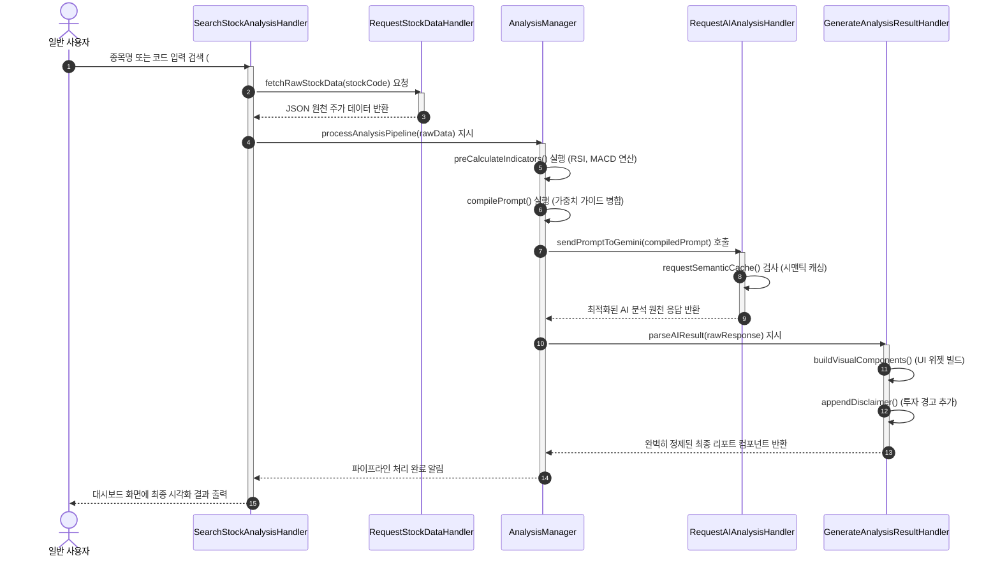

# Market Analyst Tool

### <시장분석UI예시>
## 기본 정보

- **학번:** 22212027  
- **이름:** 배근웅  

---

##  GitHub Repository

- https://github.com/BAEGEUN12/Market-anaylist-tool
## Contents

- [1. Introduction](#1-business-purpose)
- [2. Class Diagram](#2-system-context-diagram)
- [3. Sequence Diagram](#3-use-case-list)
- [4. State Machine Diagram](#4-concept-of-operation)
- [5. Implementation Requirements](#5-problem-statement)
- [6. Glossary](#6-glossary)
- [7. References](#7-references)

## 1. introduction 

최근 주식 투자에 대한 관심이 크게 증가하면서 많은 사람들이 주식 시장에 참여하고 있다.  
이러한 관심 증가는 모바일 트레이딩 시스템(MTS)의 보편화, 온라인 정보 접근성 향상, 저금리 환경으로 인한 투자 대안 탐색 등의 요인에 의해 촉진되었다.

그러나 상당수의 개인 투자자들은 충분한 지식이나 체계적인 분석 없이 감에 의존하거나 단순한 정보만을 기반으로 투자하는 경우가 많다.  
이로 인해 비효율적인 투자 판단이나 손실이 발생할 가능성이 높아지고 있으며, 주식 분석에 대한 접근성과 이해도를 높이는 도구의 필요성이 커지고 있다.
특히, 금융 시장에서는 데이터와 수학적 모델을 기반으로 한 알고리즘 트레이딩이 널리 활용되고 있으며, 이는 감정에 의존하지 않고 객관적인 기준을 통해 투자 의사결정을 수행한다는 특징을 가진다.
예를 들어월가(Wall Street)에서는 수학적 알고리즘과 데이터 기반 모델을 활용한 정교한 매매 시스템이 활용되고 있으며, 이는 감정에 의존하지 않고 객관적인 분석을 통해 투자 의사결정을 수행한다는 점에서 높은 효율성을 보인다.
비록 이러한 구체적인 알고리즘은 공개되어 있지 않지만, 데이터 기반 분석과 정량적 접근 방식 자체는 개인 투자자에게도 충분히 적용 가능한 개념이다.

본 프로젝트는 이러한 알고리즘 기반 투자 방식의 원리를 바탕으로, 일반 사용자도 쉽게 활용할 수 있는 주식 분석 시스템을 구현하는 것을 목표로 한다.
아래는 Analysis에 이은 이 System개발의 세 번째 단계인 Design에 관한 내용으로써, 실제 System 구현에 직접적으로 관여하는 모든 요소들의 윤곽을 확정하고 구체적으로 디자인 해 나가는 내용을 다루고 있다. 본 문서의 모든 세부 사항은 직접적인 구현 시 소스코드상 에서의 일치를 목표로 한다.

## 2. Class Diagram

###아래의 그림은 시스템의 클래스 다이어 그램을 표현한 그림이다.

### 2.1 상세 클래스 정의 명세서 (Class Specification Table)

| Class Name | Explanation |
| :--- | :--- |
| **Member** | 시스템의 회원 데이터를 나타내는 핵심 도메인 클래스이다.  - 사용자 ID, 암호화된 비밀번호, 성명, 이메일 및 직책 권한(`authority`) 필드를 외부로부터 은닉화(Capsulation)하여 안전하게 보호한다. - `getID() : String`, `getPassword() : String`, `getAuthority() : String` 등의 Getter 메서드를 제공하여 인증 및 권한 확인 시 신원 조회를 지원한다. |
| **Registration** | 회원 가입 시 입력 정보의 유효성을 검사하고 시스템 파일 및 로컬 DB에 안정적으로 등록하는 회원가입 전담 제어 클래스이다.  - `overlapCheck(id : String) : boolean` : 사용자가 가입 요청한 ID가 기존 회원 관리 데이터 풀에 이미 존재하는지 조회하여 고유성을 보장하는 메서드이다. - `passwordCheck(p1 : JPasswordField, p2 : JPasswordField) : boolean` : 패스워드 입력란과 재확인 입력란의 값이 완벽히 일치하는지 보안 규격을 1차 검증하는 메서드이다. - `registerMemberToFile(data : Member) : void` : 모든 유효성 검증이 완료된 Member 객체 데이터를 파일 시스템으로 이관하여 영구 저장하는 메서드이다. |
| **Server** | 시스템 내부의 전체 회원 정보 풀(Pool)과 데이터 스트림을 구조적으로 유지 보수하고 영구 저장 장치와 인터페이스하는 데이터 백엔드 허브 클래스이다.  - 내부적으로 `TreeMap<String, Member>` 자료구조를 필수 도입하여 다수의 회원 데이터를 효율적이고 빠르게 탐색·관리한다. - `getMemberData() : File` : 로컬 저장소에 저장된 회원 명부 파일을 안전하게 읽어와 인스턴스화하는 메서드이다. - `saveMemberData(data : Member) : void` : 새로 등록되거나 수정된 회원 객체 데이터를 물리 파일에 실시간 업데이트 및 동기화하는 메서드이다. |
| **Login** | 사용자 및 최고 관리자가 시스템에 최초 접근하기 위한 게이트웨이 화면 UI 및 상호작용 제어 클래스이다.  - `JTextField` 및 `JPasswordField` 입력 컴포넌트를 직접 제어하여 사용자의 키 이벤트를 캡처한다. - `loginCheck(id : String, password : char[]) : boolean` : 입력된 자격 증명 정보를 가져와 `LoginVerificationManager`에 대조 검증을 요청하고 세션 가동을 최우선 트리거하는 메서드이다. |
| **LoginVerificationManager** | 입력된 정보의 보안 무결성을 검증하고, 세션 토큰 발행 및 접근한 계정의 권한 유형(일반 유저 / 최고 관리자)을 통제하는 보안 매니저 클래스이다.  - `authenticate(id : String, password : char[]) : boolean` : 전달받은 패스워드를 DB 내부의 암호화 필드와 비교 대조하여 일치 여부를 판단하는 메서드이다. - `verifySession(token : String) : boolean` : 현재 실행 중인 세션 토큰의 변조 여부 및 만료 수명 주기를 실시간 모니터링하는 메서드이다. - `checkAuthorization(id : String) : List<String>` : 검증 성공 시 해당 계정의 등급을 판별하여 일반 유저 대시보드 또는 관리자 제어 화면으로의 진입 분기를 완벽히 통제하는 메서드이다. |
| **UserControls** | 일반 사용자 권한 대시보드에서 접근 가능한 UI 컴포넌트와 화면 상태를 관리하는 컨트롤 클래스이다.  - 주식 검색창(`searchUI`)과 사용자가 현재 활성화하여 조회 중인 종목 차트 정보(`viewingChart`)를 유지한다. - `searchStock() : void` : 검색창 입력을 감지하고 사용자의 분석 요청 이벤트를 캡처하여 메인 분석 파이프라인인 `SearchStockAnalysisHandler`를 호출하는 메서드이다. |
| **AdministratorControls** | 시스템 최고 관리자 권한 대시보드에서 접근 가능한 특수 알고리즘 튜닝 및 화면 배치 제어 UI 클래스이다.  - 가중치를 실시간 제어하는 슬라이더 컴포넌트 리스트(`weightSliders`) 및 유저 화면의 위젯 가시성 스위치(`layoutSwitches`)를 관리한다. - `adjustWeights() : void` : 슬라이더 입력 값을 기반으로 알고리즘 매개변수를 튜닝한다. - `toggleWidgetVisibility() : void` : 일반 유저의 대시보드 컴포넌트 노출 여부를 제어한다. - `monitorTraffic() : void` : 서버의 실시간 통신 및 트래픽 상태를 시각적으로 모니터링하는 메서드이다. |
| **SearchStockAnalysisHandler** | 사용자가 특정 주식 종목을 검색하고 분석을 요청하는 메인 유스케이스의 전체 워크플로우를 조율하는 중앙 파이프라인 컨트롤러 클래스이다.  - `searchStock(query : String, sessionToken : String) : void` : 전달받은 검색어의 유효성을 세션 권한과 함께 검증한 뒤 전체 데이터 수집 및 연산 파이프라인을 기동하는 메서드이다. - `displayResult(panel : JPanel) : void` : 하위 비즈니스 로직 핸들러들에 의해 최종 연산·가공된 시각적 차트와 AI 리포트 컴포넌트를 메인 대시보드 UI 영역에 최종 렌더링하는 메서드이다. |
| **AnalysisManager** | 외부 금융 API로부터 수집된 주가 원천 데이터를 정량적 알고리즘으로 가공하고 AI 프롬프트 생성을 최적화하는 비즈니스 로직 핵심 클래스이다.  - `preCalculateIndicators(rawData : String) : void` : 수신된 JSON 형태의 주가 로우 데이터로부터 **RSI, MACD, 이동평균선** 등의 기술적 지표를 서버 내부에서 직접 선행 계산하여 데이터 무결성을 확보하는 메서드이다. - `compilePrompt(indicators : Map<String, Double>, guide : String) : String` : 정량 연산된 기술적 지표 수치들과 관리자가 설정한 실시간 평가 가치 가이드라인을 정교하게 결합하여 최적화된 프롬프트를 조립하는 메서드이다. - `processAnalysisPipeline(stockCode : String) : void` : 종목에 대한 수집, 계산, AI 호출, 결과 출력 파이프라인을 순차적으로 수행하고 예외를 총괄 관리하는 메서드이다. |
| **RequestStockDataHandler** | 외부 주식 시장 정보 오픈 API 서버와의 원격 통신 및 트래픽 제한(Rate Limit)을 통제하는 데이터 수집 핸들러 클래스이다.  - `fetchRawStockData(stockCode : String) : String` : 지정된 주식 코드의 실시간 시세 및 차트 데이터를 HTTP 네트워크 통신을 통해 외부 금융 서버로부터 원격 수집하는 메서드이다. - `parseJSONData(json : String) : Map<String, Object>` : 수신된 JSON 문서를 시스템 내부 알고리즘이 즉시 활용할 수 있도록 정형화된 컬렉션 데이터 구조로 파싱하는 메서드이다. |
| **RequestAIAnalysisHandler** | Google Gemini API 인프라와의 안정적인 네트워크 통신을 전담하고 서비스 운영 비용을 최적화하는 AI 게이트웨이 핸들러 클래스이다.  - `requestSemanticCache(prompt : String) : String` : 입력된 프롬프트가 이전 질의와 의미적으로 유사한지 비교하여 캐시된 기존 답변을 즉시 반환함으로써 API 호출 횟수를 획기적으로 절감하는 메서드이다. - `sendPromptToGemini(prompt : String) : String` : 캐시가 존재하지 않을 경우, 멀티 API 키 로테이션 배열(`multiApiKeys`)에서 가용한 키를 할당받아 최종적으로 Google Gemini 모델 서버에 분석 요청을 전송하는 메서드이다. |
| **GenerateAnalysisResultHandler** | AI 모델 서버로부터 반환된 비정형 응답을 구조적인 비즈니스 언어로 재정제하고 사용자 화면에 가독성 높은 GUI 컴포넌트를 빌드하는 출력 처리 클래스이다.  - `parseAIResult(response : String) : Map<String, String>` : Gemini의 로우 응답 본문에서 매수/매도/보유 등급 신호와 핵심 근거 코멘트 영역을 정확히 분리 추출하는 메서드이다. - `buildVisualComponents() : void` : 분리된 데이터를 기반으로 시각적 신호 지표 및 컴포넌트를 동적으로 생성하는 메서드이다. - `appendDisclaimer() : void` : 모든 분석 결과 리포트 최하단에 시스템의 안정성과 법적 한계 명시를 위한 '최종 투자 책임 경고 문구'를 강제 삽입하는 메서드이다. |
| **StockAPIInterface** | 외부 주식 시장 데이터 제공업체 API 서버와의 실제 네트워크 세션 연결 및 소켓 패킷 전송을 전담하는 Boundary(바운더리) 클래스이다.  - `sendRequest(endpoint : String, params : Map) : String` : 지정된 금융 엔드포인트 엔드포인트와 매개변수를 HTTP 프로토콜 규격 패킷으로 캡슐화하여 원격 요청 및 응답 가공을 수행하는 메서드이다. |
| **GeminiAPIInterface** | Google Gemini 대규모 언어 모델 API 인프라 서버와의 실제 네트워크 물리 트랜잭션을 전담하는 Boundary(바운더리) 클래스이다.  - `callGenerativeModel(payload : String) : String` : 지정된 AI 모델 규격(Gemini-Pro 등)의 엔드포인트 규격에 맞춰 최종 조립된 프롬프트 페이로드를 안전하게 송수신 처리하는 메서드이다. |
| **EvaluationValueManager** | 관리자가 입력한 주식 판단 평가 기준 가중치(Weights) 매개변수를 실시간으로 백엔드 로직에 동적 반영하고 유지하는 관리자 매니저 클래스이다.  - `updateWeights() : void` : 관리자 UI 화면에서 변경된 기술적 지표, 뉴스 데이터 비중 수치(`weights: Map`)를 프롬프트 조립 규칙에 즉시 오버라이드하여 적용하는 메서드이다. - `backupSettings() : void` : 비정상적인 서버 종료나 설정 오작동에 대비하여 가중치 설정 스냅샷을 안전한 파일 형태로 실시간 백업해두는 메서드이다. |
| **LayoutAdjustmentManager** | 대시보드 화면 구성 정보 및 일반 사용자의 위젯 동적 배치 상태를 제어하는 화면 레이아웃 매니저 클래스이다.  - `applyLayoutChange() : void` : 관리자가 통제한 차트, 뉴스피드, 분석 신호 등의 컴포넌트 상대 좌표 데이터(`componentPositions`)를 파싱하여 사용자 인터페이스 화면에 유동적으로 반영하는 메서드이다. |
---

## 3. Sequence Diagram

### 3.1 주식 분석 조회 및 AI 분석 실행 파이프라인

---

