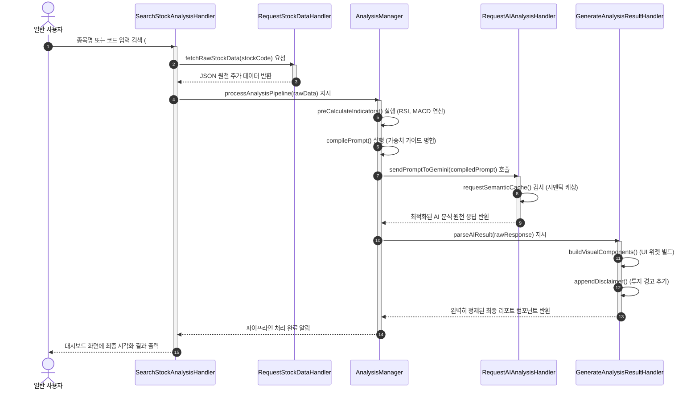

# Market Analyst Tool

### <시장분석UI예시>
## 기본 정보

- **학번:** 22212027  
- **이름:** 배근웅  

---

##  GitHub Repository

- https://github.com/BAEGEUN12/Market-anaylist-tool
## Contents

- [1. Introduction](#1-business-purpose)
- [2. Class Diagram](#2-system-context-diagram)
- [3. Sequence Diagram](#3-use-case-list)
- [4. State Machine Diagram](#4-concept-of-operation)
- [5. Implementation Requirements](#5-problem-statement)
- [6. Glossary](#6-glossary)
- [7. References](#7-references)

## 1. introduction 

최근 주식 투자에 대한 관심이 크게 증가하면서 많은 사람들이 주식 시장에 참여하고 있다.  
이러한 관심 증가는 모바일 트레이딩 시스템(MTS)의 보편화, 온라인 정보 접근성 향상, 저금리 환경으로 인한 투자 대안 탐색 등의 요인에 의해 촉진되었다.

그러나 상당수의 개인 투자자들은 충분한 지식이나 체계적인 분석 없이 감에 의존하거나 단순한 정보만을 기반으로 투자하는 경우가 많다.  
이로 인해 비효율적인 투자 판단이나 손실이 발생할 가능성이 높아지고 있으며, 주식 분석에 대한 접근성과 이해도를 높이는 도구의 필요성이 커지고 있다.
특히, 금융 시장에서는 데이터와 수학적 모델을 기반으로 한 알고리즘 트레이딩이 널리 활용되고 있으며, 이는 감정에 의존하지 않고 객관적인 기준을 통해 투자 의사결정을 수행한다는 특징을 가진다.
예를 들어월가(Wall Street)에서는 수학적 알고리즘과 데이터 기반 모델을 활용한 정교한 매매 시스템이 활용되고 있으며, 이는 감정에 의존하지 않고 객관적인 분석을 통해 투자 의사결정을 수행한다는 점에서 높은 효율성을 보인다.
비록 이러한 구체적인 알고리즘은 공개되어 있지 않지만, 데이터 기반 분석과 정량적 접근 방식 자체는 개인 투자자에게도 충분히 적용 가능한 개념이다.

본 프로젝트는 이러한 알고리즘 기반 투자 방식의 원리를 바탕으로, 일반 사용자도 쉽게 활용할 수 있는 주식 분석 시스템을 구현하는 것을 목표로 한다.
아래는 Analysis에 이은 이 System개발의 세 번째 단계인 Design에 관한 내용으로써, 실제 System 구현에 직접적으로 관여하는 모든 요소들의 윤곽을 확정하고 구체적으로 디자인 해 나가는 내용을 다루고 있다. 본 문서의 모든 세부 사항은 직접적인 구현 시 소스코드상 에서의 일치를 목표로 한다.

## 2. Class Diagram

###아래의 그림은 시스템의 클래스 다이어 그램을 표현한 그림이다.

### 2.1 상세 클래스 정의 명세서 (Class Specification Table)

| Class Name | Explanation |
| :--- | :--- |
| **Login** | 시스템을 실행하고 로그인을 진행할 때 사용자가 입력한 아이디와 비밀번호를 1차적으로 캡처하고 제어하는 UI 및 컨트롤 클래스이다.  - `loginCheck(id : String, password : char[]) : boolean` : 아이디와 비밀번호 입력란에 입력한 정보들을 안전하게 가져와 등록된 회원인지, 등록된 회원이라면 비밀번호와 권한이 일치하는지 `LoginVerificationManager`에 대조 검증을 요청하는 메서드이다. |
| **Registration** | 시스템 사용을 위해 새로운 사용자가 회원 등록을 진행할 때 데이터 유효성을 검증하고 가입 절차를 처리하는 클래스이다.  - `overlapCheck(id : String) : boolean` : 사용자가 입력한 ID가 시스템 데이터베이스 및 회원 파일에 이미 존재하는지 조회하여 고유성을 보장하는 메서드이다. - `passwordCheck(p1 : JPasswordField, p2 : JPasswordField) : boolean` : 비밀번호 입력 필드와 확인 필드의 값이 일치하는지, 보안 규격에 부합하는지 검사하는 메서드이다. - `registerMemberToFile(data : Member) : void` : 검증이 완료된 가입 신청자의 정보를 객체화하여 `Server` 클래스의 멤버 관리 저장소로 이관하는 메서드이다. |
| **Server** | 시스템 내부의 전체 회원 정보 풀(Pool)과 실시간 통신 상태, 데이터 스트림을 유지 보수하고 영구 저장 장치와 인터페이스하는 데이터 백엔드 허브 클래스이다.  - `getMemberData() : File` : 파일 또는 로컬 저장소로부터 기존에 등록된 전체 회원 명부 데이터를 안전하게 인스턴스화하여 읽어오는 메서드이다. - `saveMemberData(data : Member) : void` : 새로 가입하거나 정보가 변경된 회원의 객체 데이터를 파일 시스템 구조에 실시간으로 업데이트 및 동기화하여 저장하는 메서드이다. |
| **LoginVerificationManager** | 입력된 정보의 보안 무결성을 검증하고, 세션 토큰 발행 및 접근한 계정의 권한 유형(일반 유저 / 최고 관리자)을 통제하는 보안 매니저 클래스이다.  - `authenticate(id : String, password : char[]) : boolean` : 전달받은 일반 텍스트 패스워드를 해싱 알고리즘으로 변환한 뒤 DB 내부의 암호화 필드와 비교 검증하는 메서드이다. - `verifySession(token : String) : boolean` : 현재 유지되고 있는 사용자 세션의 만료 여부 및 조작 여부를 실시간으로 체크하는 메서드이다. - `checkAuthorization(id : String) : List<String>` : 검증된 계정의 등급을 판단하여 유저 컨트롤 레이아웃 혹은 관리자 전용 제어 화면으로 분기할 수 있도록 권한 리스트를 반환하는 메서드이다. |
| **SearchStockAnalysisHandler** | 사용자가 특정 주식 종목을 검색하고 분석을 요청하는 메인 유스케이스의 전체 워크플로우를 조율하는 중앙 컨트롤러 클래스이다.  - `searchStock(query : String, sessionToken : String) : void` : 입력창으로부터 전달받은 검색어(종목명 또는 6자리 종목 코드)의 유효성을 세션 권한과 함께 검증한 뒤 전체 분석 파이프라인을 작동시키는 메서드이다. - `displayResult(panel : JPanel) : void` : 하위 핸들러들에 의해 최종 가공된 시각적 리포트 컴포넌트(차트, AI 텍스트 평가지)를 메인 대시보드 UI 영역에 렌더링하는 메서드이다. |
| **AnalysisManager** | 외부에서 수집된 주가 및 재무 원천 데이터를 정량적 알고리즘으로 가공하고, AI 컴파일러 역할을 담당하는 비즈니스 로직 핵심 클래스이다.  - `preCalculateIndicators(rawData : String) : void` : 수신된 JSON 형태의 로우 데이터로부터 **RSI, MACD, 이동평균선(SMA/EMA)** 등의 핵심 보조지표를 서버 내부에서 직접 선행 계산하여 AI의 토큰 소모를 방지하는 메서드이다. - `compilePrompt(indicators : Map<String, Double>, guide : String) : String` : 계산 완료된 기술적 지표 수치들과 관리자가 설정한 평가 가치 가이드라인을 정교하게 결합하여 최적의 AI 분석용 프롬프트를 조립하는 메서드이다. - `processAnalysisPipeline(stockCode : String) : void` : 데이터 요청부터 지표 계산, AI 호출 및 결과 생성을 순차적으로 지시하고 예외를 처리하는 파이프라인 총괄 제어 메서드이다. |
| **RequestStockDataHandler** | 외부 주식 시장 정보 오픈 API 서버와의 원격 통신 및 데이터 수신 트래픽을 전담 제어하는 데이터 핸들러 클래스이다.  - `fetchRawStockData(stockCode : String) : String` : 지정된 주식 코드의 실시간 시세 및 과거 차트 데이터를 HTTP 통신을 통해 원격 서버로부터 수집하는 메서드이다. 내부 트래픽 제한(Rate Limit) 카운터를 반영한다. - `parseJSONData(json : String) : Map<String, Object>` : 수신된 대용량 JSON 텍스트 문서를 시스템 내부 알고리즘이 즉시 연산할 수 있도록 컬렉션 형태의 구조화된 데이터 모델로 파싱하는 메서드이다. |
| **RequestAIAnalysisHandler** | 구글 Gemini API 인프라와의 통신 안정성을 확보하고 서비스 운영 비용을 최적화하는 AI 게이트웨이 핸들러 클래스이다.  - `requestSemanticCache(prompt : String) : String` : 입력된 프롬프트가 이전 질의와 의미적으로 유사한지 비교하여 캐시된 기존 답변을 즉시 반환함으로써 API 호출 횟수를 획기적으로 절감하는 메서드이다. - `sendPromptToGemini(prompt : String) : String` : 시맨틱 캐시가 존재하지 않을 경우, 멀티 API 키 로테이션 배열(`multiApiKeys`)에서 가용한 키를 할당받아 최종적으로 Google Gemini 모델에 네트워크 요청을 전송하는 메서드이다. |
| **GenerateAnalysisResultHandler** | AI 모델로부터 반환된 비정형 분석 텍스트를 구조적인 비즈니스 언어로 재정제하고 사용자 화면에 맞춤형 위젯을 바인딩하는 출력 처리 클래스이다.  - `parseAIResult(response : String) : Map<String, String>` : Gemini의 응답 본문에서 매수/매도/보유 등급 신호와 구체적인 근거 문장을 정확히 분리 추출하는 메서드이다. - `buildVisualComponents() : void` : 추출된 데이터와 신호 비율(%)을 차트 및 가독성 높은 GUI 컴포넌트 형태로 동적 생성하는 메서드이다. - `appendDisclaimer() : void` : 시스템 안정성과 법적 책임을 위해 모든 리포트 하단에 '최종 투자 책임은 본인에게 있다'는 경고 문구를 강제 삽입하는 메서드이다. |
| **EvaluationValueManager** | 관리자가 시스템 메인 화면의 슬라이더를 통해 AI 판단 로직의 핵심 가중치(Weights)를 직접 제어할 수 있도록 백엔드 매개변수를 동적 반영하는 클래스이다.  - `updateWeights() : void` : UI 설정 창에서 변경된 기술적 지표, 뉴스 심리, 재무 데이터 간의 가중치 비율을 시스템 컨텍스트에 즉시 갱신 반영하는 메서드이다. - `backupSettings() : void` : 비정상적인 서버 종료나 설정 오작동에 대비하여 가중치 템플릿의 스냅샷을 영구 저장소에 실시간 백업하는 메서드이다. |
| **LayoutAdjustmentManager** | 최고 관리자가 사용자의 메인 화면 화면 구성 요소 배치 및 가시성을 동적으로 통제할 수 있도록 컴포넌트 메타데이터를 관리하는 클래스이다.  - `applyLayoutChange() : void` : 차트 영역, 뉴스 피드, AI 추천 신호 위젯 등의 좌표 값 및 활성화 토글 스위치 상태를 분석하여 화면 레이아웃 템플릿에 즉시 투영하는 메서드이다. |

---

## 3. Sequence Diagram

### 3.1 주식 분석 조회 및 AI 분석 실행 파이프라인

---

