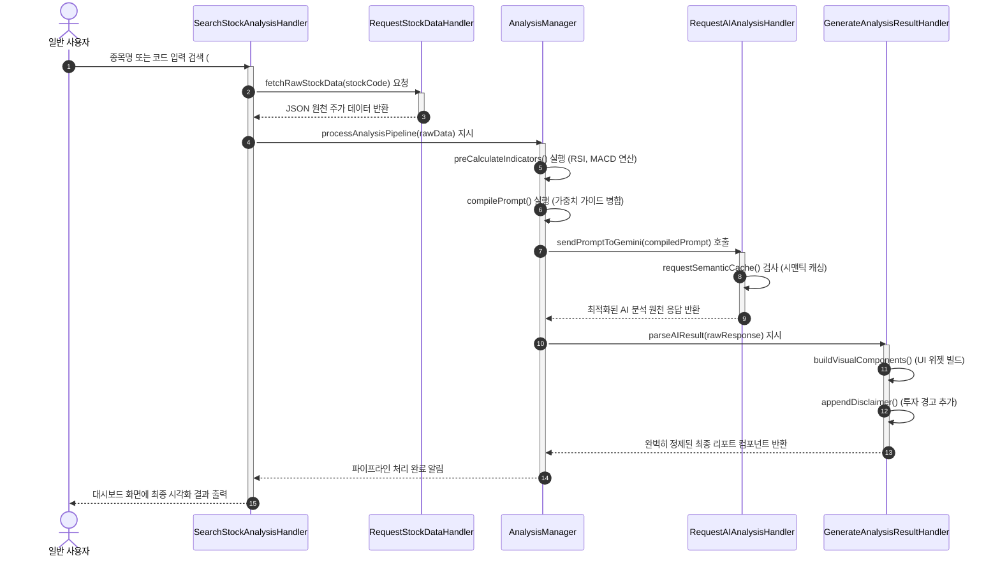

# Market Analyst Tool

### <시장분석UI예시>
## 기본 정보

- **학번:** 22212027  
- **이름:** 배근웅  

---

##  GitHub Repository

- https://github.com/BAEGEUN12/Market-anaylist-tool
## Contents

- [1. Introduction](#1-business-purpose)
- [2. Class Diagram](#2-system-context-diagram)
- [3. Sequence Diagram](#3-use-case-list)
- [4. State Machine Diagram](#4-concept-of-operation)
- [5. Implementation Requirements](#5-problem-statement)
- [6. Glossary](#6-glossary)
- [7. References](#7-references)

## 1. introduction 

최근 주식 투자에 대한 관심이 크게 증가하면서 많은 사람들이 주식 시장에 참여하고 있다.  
이러한 관심 증가는 모바일 트레이딩 시스템(MTS)의 보편화, 온라인 정보 접근성 향상, 저금리 환경으로 인한 투자 대안 탐색 등의 요인에 의해 촉진되었다.

그러나 상당수의 개인 투자자들은 충분한 지식이나 체계적인 분석 없이 감에 의존하거나 단순한 정보만을 기반으로 투자하는 경우가 많다.  
이로 인해 비효율적인 투자 판단이나 손실이 발생할 가능성이 높아지고 있으며, 주식 분석에 대한 접근성과 이해도를 높이는 도구의 필요성이 커지고 있다.
특히, 금융 시장에서는 데이터와 수학적 모델을 기반으로 한 알고리즘 트레이딩이 널리 활용되고 있으며, 이는 감정에 의존하지 않고 객관적인 기준을 통해 투자 의사결정을 수행한다는 특징을 가진다.
예를 들어월가(Wall Street)에서는 수학적 알고리즘과 데이터 기반 모델을 활용한 정교한 매매 시스템이 활용되고 있으며, 이는 감정에 의존하지 않고 객관적인 분석을 통해 투자 의사결정을 수행한다는 점에서 높은 효율성을 보인다.
비록 이러한 구체적인 알고리즘은 공개되어 있지 않지만, 데이터 기반 분석과 정량적 접근 방식 자체는 개인 투자자에게도 충분히 적용 가능한 개념이다.

본 프로젝트는 이러한 알고리즘 기반 투자 방식의 원리를 바탕으로, 일반 사용자도 쉽게 활용할 수 있는 주식 분석 시스템을 구현하는 것을 목표로 한다.
아래는 Analysis에 이은 이 System개발의 세 번째 단계인 Design에 관한 내용으로써, 실제 System 구현에 직접적으로 관여하는 모든 요소들의 윤곽을 확정하고 구체적으로 디자인 해 나가는 내용을 다루고 있다. 본 문서의 모든 세부 사항은 직접적인 구현 시 소스코드상 에서의 일치를 목표로 한다.

## 2. Class Diagram

###아래의 그림은 시스템의 클래스 다이어 그램을 표현한 그림이다.

### 2.1 상세 클래스 정의 명세서 (Class Specification Table)

| Class Name | Explanation |
| :--- | :--- |
| **Member** | 시스템의 회원 데이터를 나타내는 핵심 도메인 클래스이다.  - 사용자 ID, 암호화된 비밀번호, 성명, 이메일 및 직책 권한(`authority`) 필드를 외부로부터 은닉화(Capsulation)하여 안전하게 보호한다. - `getID() : String`, `getPassword() : String`, `getAuthority() : String` 등의 Getter 메서드를 제공하여 인증 및 권한 확인 시 신원 조회를 지원한다. |
| **Registration** | 회원 가입 시 입력 정보의 유효성을 검사하고 시스템 파일 및 로컬 DB에 안정적으로 등록하는 회원가입 전담 제어 클래스이다.  - `overlapCheck(id : String) : boolean` : 사용자가 가입 요청한 ID가 기존 회원 관리 데이터 풀에 이미 존재하는지 조회하여 고유성을 보장하는 메서드이다. - `passwordCheck(p1 : JPasswordField, p2 : JPasswordField) : boolean` : 패스워드 입력란과 재확인 입력란의 값이 완벽히 일치하는지 보안 규격을 1차 검증하는 메서드이다. - `registerMemberToFile(data : Member) : void` : 모든 유효성 검증이 완료된 Member 객체 데이터를 파일 시스템으로 이관하여 영구 저장하는 메서드이다. |
| **Server** | 시스템 내부의 전체 회원 정보 풀(Pool)과 데이터 스트림을 구조적으로 유지 보수하고 영구 저장 장치와 인터페이스하는 데이터 백엔드 허브 클래스이다.  - 내부적으로 `TreeMap<String, Member>` 자료구조를 필수 도입하여 다수의 회원 데이터를 효율적이고 빠르게 탐색·관리한다. - `getMemberData() : File` : 로컬 저장소에 저장된 회원 명부 파일을 안전하게 읽어와 인스턴스화하는 메서드이다. - `saveMemberData(data : Member) : void` : 새로 등록되거나 수정된 회원 객체 데이터를 물리 파일에 실시간 업데이트 및 동기화하는 메서드이다. |
| **Login** | 사용자 및 최고 관리자가 시스템에 최초 접근하기 위한 게이트웨이 화면 UI 및 상호작용 제어 클래스이다.  - `JTextField` 및 `JPasswordField` 입력 컴포넌트를 직접 제어하여 사용자의 키 이벤트를 캡처한다. - `loginCheck(id : String, password : char[]) : boolean` : 입력된 자격 증명 정보를 가져와 `LoginVerificationManager`에 대조 검증을 요청하고 세션 가동을 최우선 트리거하는 메서드이다. |
| **LoginVerificationManager** | 입력된 정보의 보안 무결성을 검증하고, 세션 토큰 발행 및 접근한 계정의 권한 유형(일반 유저 / 최고 관리자)을 통제하는 보안 매니저 클래스이다.  - `authenticate(id : String, password : char[]) : boolean` : 전달받은 패스워드를 DB 내부의 암호화 필드와 비교 대조하여 일치 여부를 판단하는 메서드이다. - `verifySession(token : String) : boolean` : 현재 실행 중인 세션 토큰의 변조 여부 및 만료 수명 주기를 실시간 모니터링하는 메서드이다. - `checkAuthorization(id : String) : List<String>` : 검증 성공 시 해당 계정의 등급을 판별하여 일반 유저 대시보드 또는 관리자 제어 화면으로의 진입 분기를 완벽히 통제하는 메서드이다. |
| **UserControls** | 일반 사용자 권한 대시보드에서 접근 가능한 UI 컴포넌트와 화면 상태를 관리하는 컨트롤 클래스이다.  - 주식 검색창(`searchUI`)과 사용자가 현재 활성화하여 조회 중인 종목 차트 정보(`viewingChart`)를 유지한다. - `searchStock() : void` : 검색창 입력을 감지하고 사용자의 분석 요청 이벤트를 캡처하여 메인 분석 파이프라인인 `SearchStockAnalysisHandler`를 호출하는 메서드이다. |
| **AdministratorControls** | 시스템 최고 관리자 권한 대시보드에서 접근 가능한 특수 알고리즘 튜닝 및 화면 배치 제어 UI 클래스이다.  - 가중치를 실시간 제어하는 슬라이더 컴포넌트 리스트(`weightSliders`) 및 유저 화면의 위젯 가시성 스위치(`layoutSwitches`)를 관리한다. - `adjustWeights() : void` : 슬라이더 입력 값을 기반으로 알고리즘 매개변수를 튜닝한다. - `toggleWidgetVisibility() : void` : 일반 유저의 대시보드 컴포넌트 노출 여부를 제어한다. - `monitorTraffic() : void` : 서버의 실시간 통신 및 트래픽 상태를 시각적으로 모니터링하는 메서드이다. |
| **SearchStockAnalysisHandler** | 사용자가 특정 주식 종목을 검색하고 분석을 요청하는 메인 유스케이스의 전체 워크플로우를 조율하는 중앙 파이프라인 컨트롤러 클래스이다.  - `searchStock(query : String, sessionToken : String) : void` : 전달받은 검색어의 유효성을 세션 권한과 함께 검증한 뒤 전체 데이터 수집 및 연산 파이프라인을 기동하는 메서드이다. - `displayResult(panel : JPanel) : void` : 하위 비즈니스 로직 핸들러들에 의해 최종 연산·가공된 시각적 차트와 AI 리포트 컴포넌트를 메인 대시보드 UI 영역에 최종 렌더링하는 메서드이다. |
| **AnalysisManager** | 외부 금융 API로부터 수집된 주가 원천 데이터를 정량적 알고리즘으로 가공하고 AI 프롬프트 생성을 최적화하는 비즈니스 로직 핵심 클래스이다.  - `preCalculateIndicators(rawData : String) : void` : 수신된 JSON 형태의 주가 로우 데이터로부터 **RSI, MACD, 이동평균선** 등의 기술적 지표를 서버 내부에서 직접 선행 계산하여 데이터 무결성을 확보하는 메서드이다. - `compilePrompt(indicators : Map<String, Double>, guide : String) : String` : 정량 연산된 기술적 지표 수치들과 관리자가 설정한 실시간 평가 가치 가이드라인을 정교하게 결합하여 최적화된 프롬프트를 조립하는 메서드이다. - `processAnalysisPipeline(stockCode : String) : void` : 종목에 대한 수집, 계산, AI 호출, 결과 출력 파이프라인을 순차적으로 수행하고 예외를 총괄 관리하는 메서드이다. |
| **RequestStockDataHandler** | 외부 주식 시장 정보 오픈 API 서버와의 원격 통신 및 트래픽 제한(Rate Limit)을 통제하는 데이터 수집 핸들러 클래스이다.  - `fetchRawStockData(stockCode : String) : String` : 지정된 주식 코드의 실시간 시세 및 차트 데이터를 HTTP 네트워크 통신을 통해 외부 금융 서버로부터 원격 수집하는 메서드이다. - `parseJSONData(json : String) : Map<String, Object>` : 수신된 JSON 문서를 시스템 내부 알고리즘이 즉시 활용할 수 있도록 정형화된 컬렉션 데이터 구조로 파싱하는 메서드이다. |
| **RequestAIAnalysisHandler** | Google Gemini API 인프라와의 안정적인 네트워크 통신을 전담하고 서비스 운영 비용을 최적화하는 AI 게이트웨이 핸들러 클래스이다.  - `requestSemanticCache(prompt : String) : String` : 입력된 프롬프트가 이전 질의와 의미적으로 유사한지 비교하여 캐시된 기존 답변을 즉시 반환함으로써 API 호출 횟수를 획기적으로 절감하는 메서드이다. - `sendPromptToGemini(prompt : String) : String` : 캐시가 존재하지 않을 경우, 멀티 API 키 로테이션 배열(`multiApiKeys`)에서 가용한 키를 할당받아 최종적으로 Google Gemini 모델 서버에 분석 요청을 전송하는 메서드이다. |
| **GenerateAnalysisResultHandler** | AI 모델 서버로부터 반환된 비정형 응답을 구조적인 비즈니스 언어로 재정제하고 사용자 화면에 가독성 높은 GUI 컴포넌트를 빌드하는 출력 처리 클래스이다.  - `parseAIResult(response : String) : Map<String, String>` : Gemini의 로우 응답 본문에서 매수/매도/보유 등급 신호와 핵심 근거 코멘트 영역을 정확히 분리 추출하는 메서드이다. - `buildVisualComponents() : void` : 분리된 데이터를 기반으로 시각적 신호 지표 및 컴포넌트를 동적으로 생성하는 메서드이다. - `appendDisclaimer() : void` : 모든 분석 결과 리포트 최하단에 시스템의 안정성과 법적 한계 명시를 위한 '최종 투자 책임 경고 문구'를 강제 삽입하는 메서드이다. |
| **StockAPIInterface** | 외부 주식 시장 데이터 제공업체 API 서버와의 실제 네트워크 세션 연결 및 소켓 패킷 전송을 전담하는 Boundary(바운더리) 클래스이다.  - `sendRequest(endpoint : String, params : Map) : String` : 지정된 금융 엔드포인트 엔드포인트와 매개변수를 HTTP 프로토콜 규격 패킷으로 캡슐화하여 원격 요청 및 응답 가공을 수행하는 메서드이다. |
| **GeminiAPIInterface** | Google Gemini 대규모 언어 모델 API 인프라 서버와의 실제 네트워크 물리 트랜잭션을 전담하는 Boundary(바운더리) 클래스이다.  - `callGenerativeModel(payload : String) : String` : 지정된 AI 모델 규격(Gemini-Pro 등)의 엔드포인트 규격에 맞춰 최종 조립된 프롬프트 페이로드를 안전하게 송수신 처리하는 메서드이다. |
| **EvaluationValueManager** | 관리자가 입력한 주식 판단 평가 기준 가중치(Weights) 매개변수를 실시간으로 백엔드 로직에 동적 반영하고 유지하는 관리자 매니저 클래스이다.  - `updateWeights() : void` : 관리자 UI 화면에서 변경된 기술적 지표, 뉴스 데이터 비중 수치(`weights: Map`)를 프롬프트 조립 규칙에 즉시 오버라이드하여 적용하는 메서드이다. - `backupSettings() : void` : 비정상적인 서버 종료나 설정 오작동에 대비하여 가중치 설정 스냅샷을 안전한 파일 형태로 실시간 백업해두는 메서드이다. |
| **LayoutAdjustmentManager** | 대시보드 화면 구성 정보 및 일반 사용자의 위젯 동적 배치 상태를 제어하는 화면 레이아웃 매니저 클래스이다.  - `applyLayoutChange() : void` : 관리자가 통제한 차트, 뉴스피드, 분석 신호 등의 컴포넌트 상대 좌표 데이터(`componentPositions`)를 파싱하여 사용자 인터페이스 화면에 유동적으로 반영하는 메서드이다. |
---

## 3. Sequence Diagram

### 3.1 주식 분석 조회 및 AI 분석 실행 파이프라인

---
### 실시간 주식 및 AI 분석 파이프라인 (Stock & AI Analysis Pipeline)

본 파이프라인은 사용자가 특정 종목을 검색했을 때, 시스템 내부에서 주가 원천 데이터를 확보하고 금융 보조 지표 연산 및 구글 Gemini API 분석을 거쳐 최종 정제된 시각화 리포트를 대시보드에 표출하는 전체 동적 흐름을 정의합니다.

##  주요 구성 요소 (Components)

| 컴포넌트명 | 역할 설명 |
| :--- | :--- |
| **User (일반 사용자)** | 종목명 또는 종목 코드를 입력하여 검색을 시작하고 최종 리포트를 확인합니다. |
| **SearchStockAnalysisHandler** | 사용자의 검색 요청을 수신하고 최종 결과를 대시보드 화면에 시각화하는 메인 컨트롤러 인터페이스입니다. |
| **RequestStockDataHandler** | 외부 주식 API 등과 통신하여 해당 종목의 JSON 형식 원천 주가 데이터(`rawData`)를 수집합니다. |
| **AnalysisManager** | 보조 지표 연산, 프롬프트 빌드, AI 분석 및 결과 가공을 총괄 제어하는 파이프라인의 중심 엔진입니다. |
| **RequestAIAnalysisHandler** | 비용 및 속도 최적화를 위한 시맨틱 캐싱을 검사하고, 구글 Gemini API에 분석 프롬프트를 전송 및 수신합니다. |
| **GenerateAnalysisResultHandler** | AI의 원천 응답을 파싱하여 UI 위젯 컴포넌트를 빌드하고 투자 책임 경고문(Disclaimer)을 결합하는 결과 정제기입니다. |

---

##  파이프라인 단계별 흐름 (Step-by-Step Flow)

### [Phase 1] 데이터 검색 및 원천 데이터 수집
1. **사용자 요청:** 사용자가 대시보드에서 종목명 또는 코드를 입력하여 검색을 요청합니다.
2. **원천 데이터 확보:** `SearchStockAnalysisHandler`가 `RequestStockDataHandler`에게 주가 데이터 수신(`fetchRawStockData`)을 요청하여 JSON 포맷의 원천 데이터를 반환받습니다.

### [Phase 2] 지표 연산 및 AI 분석 수행
3. **파이프라인 가동:** 수집된 원천 데이터를 기반으로 `AnalysisManager`가 중앙 제어 파이프라인(`processAnalysisPipeline`)을 구동합니다.
4. **선행 연산:** 내부 알고리즘을 통해 **RSI, MACD 등의 핵심 금융 보조 지표를 자동으로 계산**(`preCalculateIndicators`)합니다.
5. **프롬프트 빌드:** 계산된 지표 데이터와 미리 정의된 지표별 가중치 가이드라인을 하나로 병합(`compilePrompt`)합니다.
6. **AI 캐시 검사 및 요청:** `RequestAIAnalysisHandler`가 Gemini API에 요청하기 전 **시맨틱 캐싱(`requestSemanticCache`)을 수행**하여 최적화된 경로로 AI 분석 원천 응답을 확보합니다.

### [Phase 3] 리포트 정제 및 최종 시각화
7. **결과 가공 및 컴포넌트 빌드:** `GenerateAnalysisResultHandler`가 AI 응답 내용을 파싱(`parseAIResult`)하고, 대시보드에 띄울 UI 위젯들을 동적으로 빌드(`buildVisualComponents`)합니다.
8. **안전장치 추가:** 법적 책임을 위한 투자 책임 판단 경고문(`appendDisclaimer`)을 리포트 하단에 결합한 후 최종 컴포넌트를 반환합니다.
9. **대시보드 출력:** 파이프라인 처리가 완료되었음을 확인한 `SearchStockAnalysisHandler`가 사용자의 대시보드 화면에 완성된 AI 주식 분석 결과 화면을 최종 시각화하여 표출합니다.

###    3.2 

본 시퀀스 다이어그램은 시스템 실행 후 사용자가 로그인을 시도할 때, 내부 컴포넌트(객체) 간의 함수 호출 흐름과 인증 결과(성공/실패)에 따른 동적 분기 처리를 정의한 설계도입니다.

#### 주요 참여 객체 (Participants)

본 흐름에 참여하는 시스템 구성 요소와 상태 모델링 매핑 정보는 다음과 같습니다.

* **LoginWindow (`UI`)**
  * 시스템 시작 단계(`LaunchSystem`)의 진입점이 되는 로그인 화면 인터페이스입니다.
* **AuthManager (`Auth`)**
  * 로그인 자격 증명 검증(`LoginVerification`) 및 사용자 권한(일반 사용자/관리자) 확인을 담당하는 핵심 제어 객체입니다.
* **MemberInfoRepository (`Member`)**
  * 인증 성공 시 해당 유저의 상세 정보를 메모리에 로드(`InitiateResult`)하는 데이터 처리 객체입니다.
* **PortalMainGUI (`Portal`)**
  * 로그인 인증이 완료된 후 진입하는 메인 대시보드 화면(`LoggedInSession`)입니다.

---

#### 시퀀스 흐름 분석 (Flow Description)

#### [기본 흐름] 자격 증명 검증 요청
1. **`UI` ➔ `Auth` (1~2번):** `LoginWindow` 컴포넌트가 활성화되면서 `AuthManager`에게 입력받은 자격 증명 검증을 요청(`LoginCheck(id, password)`)합니다.
2. **내부 연산 (3번):** `AuthManager`는 자체적으로 관리자 또는 일반 회원 여부를 확인하는 권한 검증 로직(`Check manager or member credentials`)을 수행합니다.

#### [분기 흐름 1] 인증 성공 시 (alt: true)
* **회원 정보 초기화:** 인증이 성공하면 `Auth`는 `Member` 객체의 `initiateMemberInfo()`를 호출하여 회원 정보를 메모리에 로드하고 완료 신호를 받습니다.
* **화면 전환 및 세션 진입:** `Auth`로부터 성공 결과(`true`)를 반환받은 `UI`는 메인 포탈 화면을 활성화(`Portal.setVisible(true)`)시키며, 시스템은 최종적으로 기능 선택 대기 상태인 `LoggedInSession` 세션에 진입합니다.

#### [분기 흐름 2] 인증 실패 시 (else: false)
* **에러 핸들링:** 자격 증명이 일치하지 않을 경우 `Auth`는 `UI`에게 실패 응답(`failure`)을 반환합니다.
* **입력창 초기화:** `UI`는 화면에 에러 메시지(`ErrorMessage`)를 출력하고 입력 창을 비운 뒤, 다시 첫 시스템 시작 상태(`LaunchSystem`)로 복귀하여 사용자 입력을 대기합니다.

---

#### 다이어그램 설계 특징

* **UML 표준 프레임 우회 구현:** `rect` 문법을 사용해 다이어그램 최외각에 은은한 배경 박스를 씌우고 좌측 상단에 `[Interaction Login]` 노트를 배치함으로써, UML 표준 규격의 다이어그램 프레임 범위를 시각적으로 명확히 표현했습니다.
* **상태 다이어그램과의 일관성 유지:** 각 컴포넌트의 가명(Alias) 뒤에 괄호 형태로 상태 모델링 명칭(`LaunchSystem`, `LoginVerification` 등)을 명시하여, 정적 흐름과 동적 상태 변화 간의 추적성(Traceability)을 높였습니다.
* **객체 생명 주기 명시:** `activate`와 `deactivate`를 통해 각 객체가 실제로 메모리 상에서 동작하고 응답을 대기하는 활성화 구간(Execution Specification)을 정확하게 모델링했습니다.

###  3.3

#### 주요 참여 객체 (Participants)

본 흐름에 참여하는 시스템 구성 요소와 상태 모델링 매핑 정보는 다음과 같습니다.

* **AnalysisManager (`Analysis`)**
  * 주식 분석 파이프라인의 총괄 제어 엔진(`PipelineEngine`) 역할을 하며, 금융 지표 연산이 완료된 후 AI 분석 단계를 트리거하는 주체입니다.
* **RequestAIAnalysisHandler (`AIHandler`)**
  * AI 인터페이스(`AIInterface`) 레이어로, 프롬프트 전처리, 내부 시맨틱 캐시 검사 및 외부 LLM 연동 컨트롤을 전담하는 핵심 객체입니다.
* **GeminiAPI (`Gemini`)**
  * 구글의 외부 거대 언어 모델(`ExternalLLM`)로, 입력된 프롬프트 문맥을 파악하여 정성적인 금융 리포트 원천 데이터(JSON)를 생성하는 원격 API 서비스입니다.

---

#### 시퀀스 흐름 분석 (Flow Description)

#### [기본 흐름] AI 분석 요청 및 캐시 검사
1. **`Analysis` ➔ `AIHandler` (1번):** `AnalysisManager` 컴포넌트가 대기(점선) 상태에서 `RequestAIAnalysisHandler`에게 준비된 프롬프트를 전달하며 `sendPromptToGemini(compiledPrompt)` 함수를 호출하고, 요청을 받은 `AIHandler`가 활성화됩니다.
2. **내부 연산 (2번):** `AIHandler`는 불필요한 토큰 비용 절감을 위해 즉시 자기 호출(Self-Call)을 발생시켜 내부 캐시 레이어를 검사(`requestSemanticCache()`)하며, 이 과정에서 중첩 활성화 박스(Nested Box)가 생성됩니다.

#### [분기 흐름 1] 캐시 히트 시 (alt: Cache Hit)
* **결과 즉시 재사용:** 의미적으로 동일하거나 매우 유사한 분석 요청이 기존에 존재하여 유효성 검증에 성공한 경우, 외부 API 호출 프로세스를 전면 생략하고 캐시된 AI 분석 응답 데이터를 즉시 재사용하여 최종 응답을 반환합니다.

#### [분기 흐름 2] 캐시 미스 시 (else: Cache Miss)
* **조건 및 가이드라인 반영:** 캐시에 유효한 데이터가 없을 경우, `AIHandler`는 다시 중첩 활성화 박스를 생성하고 내부 세부 분석 기준(`Apply criteria (RSI, 금융 패턴, 타임프레임 가이드라인)`)을 프롬프트에 최종 반영합니다.
* **외부 AI 호출 및 캐시 저장:** `AIHandler`는 원격의 `GeminiAPI`를 활성화시켜 분석 결과를 생성(`Post Request`)하고 원천 응답(`rawResponse JSON`)을 반환받은 뒤, 신규 분석 결과를 시맨틱 캐시에 동적 저장(`saveToSemanticCache()`)하는 자체 중첩 연산을 수행합니다.

---

#### 다이어그램 설계 특징

* **UML 표준 프레임 우회 구현:** `rect` 문법을 사용해 다이어그램 최외각에 은은한 배경 박스를 씌우고 좌측 상단에 `[Interaction Request AI Analysis]` 노트를 배치함으로써, 서브 시스템의 다이어그램 프레임 범위를 시각적으로 명확히 표현했습니다.
* **상태 다이어그램과의 일관성 유지:** 각 컴포넌트의 가명(Alias) 뒤에 괄호 형태로 상태 모델링 명칭(`PipelineEngine`, `AIInterface`, `ExternalLLM`)을 명시하여, 정적 흐름과 동적 상태 변화 간의 추적성(Traceability)을 정확히 확보했습니다.
* **중첩 활성화(Nested Activation)를 통한 정밀 모델링:** 객체가 자기 자신의 메서드를 호출하는 연산 구간(Self-Call)에서 원래 활성화 박스 위에 작은 사각형 박스가 겹쳐 쌓이는 표준 UML 레이아웃을 준수하여 객체의 실제 실행 스택 깊이를 세밀하게 구현했습니다.
### 3.4

## 4. State machine diagram

아래의 그림은 주식분석 시스템의 State machine diagram을 표현한 그림이다

## 4.1 상태 정의 명세서 (State Definition Table)

### 1) 인증 및 회원 관리 프로세스 상태 (Pre-Authentication States)

| Status (상태명) | Explanation (상태 설명) |
| :--- | :--- |
| **LaunchSystem** | 시스템이 최초 실행된 상태이다. **[do/]** 화면에 로그인 창을 표출(`Show login window`)하고 사용자가 로그인할지 회원가입할지 선택하기를 대기한다. |
| **RegisterMember** | 사용자가 회원가입을 선택하여 진입한 상태이다. **[do/]** 가입에 필요한 회원 정보 양식을 작성(`Make out membership information`)하는 단계를 수행한다. |
| **WaitInputVerificationResult** | 회원 정보 입력 완료 후 진입하는 상태이다. **[do/]** 누락된 정보가 있는지 체크하고 잘못된 입력을 교정(`Check omitted information and Correct input`)하도록 유효성 검증 결과를 대기한다. 검증 실패 시 `RegisterMember`로 돌아간다. |
| **RegisterInformation** | 유효성 검증을 통과한 후 진입하는 상태이다. **[exit/]** 회원 가입 데이터를 파일 시스템에 최종 저장(`registerMemberToFile(data) / Saving data`)하고 성공 시 `LaunchSystem`으로 전이된다. |
| **WaitInsertingUserInfo** | 사용자가 로그인을 선택하여 진입한 상태이다. **[do/]** 사용자로부터 인증에 필요한 ID와 Password 입력(`Waiting for user input`)을 대기한다. |
| **WaitLoginVerificationResult** | 사용자가 자격 증명을 제출했을 때 진입하는 상태이다. **[do/]** 제출된 계정이 관리자(Manager) 또는 일반 회원(Member) 권한인지 검증(`Check manager or member credentials`)한다. 실패 시 `LaunchSystem`으로 복귀한다. |
| **WaitInitiateResult** | 로그인 성공 후 세션을 가동하기 직전의 상태이다. **[do/]** 인증된 사용자의 고유 정보 및 개인화 설정을 백엔드 메모리에 로드(`initiateMemberInfo() / Load members information`)하는 준비 과정을 거친다. |

---

### 2) 메인 포털 및 주식·AI 분석 파이프라인 상태 (User Flow States)

| Status (상태명) | Explanation (상태 설명) |
| :--- | :--- |
| **Portal** | `LoggedInSession` 내의 중앙 제어 허브 상태이다. **[entry/]** 현재 로그인한 사용자의 신원 정보를 화면에 로드하고, **[do/]** 대시보드 상에서 사용자가 원하는 연계 기능을 선택(`Waiting for function selection`)하도록 이벤트를 대기한다. |
| **WaitDataResult** | 사용자가 주식 분석을 요청했을 때 진입한다. **[do/]** 사용자의 등급 및 접근 권한을 확인(`authority check`)하고, 외부 Stock API로부터 원천 주가 데이터 수신(`fetchRawStockData()`)이 완료될 때까지 대기한다. |
| **ProcessingIndicators** | 원천 데이터 수신 직후 진입하는 상태이다. **[entry/]** 가져온 raw 주가 데이터를 기반으로 내부 금융 알고리즘을 작동시켜 **RSI, MACD, 이동평균선 등의 보조 지표를 선행 연산**(`preCalculateIndicators()`)한다. |
| **RequestingAIAnalysis** | 연산된 지표를 기반으로 분석을 요청하는 상태이다. **[entry/]** 가중치 가이드라인과 결합된 프롬프트를 빌드하여 전송(`sendPromptToGemini()`)하고, **[do/]** 설정된 판단 기준(RSI, 패턴, 타임프레임 등)에 따라 구글 Gemini API 응답을 대기한다. |
| **GeneratingReport** | Gemini API로부터 분석 원천 응답을 수신한 상태이다. **[entry/]** AI 답변 데이터를 파싱하고 시각화 컴포넌트를 빌드(`parseAIResult() & buildVisualComponents()`)하며, **[do/]** 투자 책임 판단 경고문(`appendDisclaimer()`)을 리포트에 결합한다. |
| **ShowAnalysisData** | 최종 가공된 보고서가 완성된 상태이다. **[entry/]** 완성된 AI 주식 분석 리포트 위젯과 차트 결과물을 대시보드 화면에 최종 시각화하여 출력(`displayResult() on Dashboard`)하고 확인 후 다시 `Portal`로 복귀한다. |

---

### 3) 최고 관리자 기능 상태 (Admin Flow States)

| Status (상태명) | Explanation (상태 설명) |
| :--- | :--- |
| **WaitWeightVerification** | 관리자가 AI 가중치 기준 변경을 요청할 때 진입한다. **[do/]** 현재 세션 계정이 최고 관리자 권한을 정상적으로 보유하고 있는지 무결성을 확인(`Check manager or member`)한다. 권한이 없으면 거부되어 `Portal`로 튕겨 나간다. |
| **InputWeightData** | 관리자 권한 확인 통과 후 설정 창이 열린 상태이다. **[exit/]** 관리자가 수정한 지표별 가중치 매개변수 데이터를 세션 컨텍스트에 반영하고 업데이트(`Saving data (updateWeights)`)한다. |
| **WaitWeightSaveResult** | 가중치 데이터를 저장소에 영구 반영하는 상태이다. **[exit/]** 시스템 이상 종료에 대비하여 현재 설정 스냅샷을 스토리지 파일로 안전하게 실시간 백업(`backupSettings()`) 처리를 마무리한 뒤 `Portal`로 복귀한다. |
| **WaitLayoutVerification** | 관리자가 대시보드 화면 레이아웃 조정을 요청할 때 진입한다. **[do/]** 현재 사용자가 UI 레이아웃을 편집할 권한이 있는 관리자 등급인지 통제 검증(`Check manager or member`)을 수행한다. |
| **WaitingForLayoutRegister** | 권한이 확인되어 레이아웃 편집기 창이 활성화된 상태이다. **[entry/]** 레이아웃 등록 창을 활성화하고, **[do/]** 관리자의 컴포넌트(차트, 피드 등) 드래그 조작에 맞춰 화면 배치 프리뷰를 실시간 표출(`Show layout preview in real-time`)하며 최종 등록을 대기한다. |
| **InputLayoutData** | 관리자가 변경 사항을 적용한 상태이다. **[do/]** 확정된 대시보드 GUI 컴포넌트들의 배치 좌표 및 화면 활성화 여부 메타데이터(`applyLayoutChange()`)를 영구 저장소에 물리적으로 저장한 후 `Portal`로 돌아간다. |

---

### 4) 분석 리포트 출력 및 내보내기 상태 (Common Flow States)

| Status (상태명) | Explanation (상태 설명) |
| :--- | :--- |
| **WaitPrintVerification** | 사용자가 화면의 AI 주식 분석 결과 데이터를 인쇄하거나 내보내기 요청을 했을 때 진입한다. **[do/]** 현재 내보내기 이벤트를 발생시킨 세션이 유효한 상태인지 최종 권한 점검(`Check manager or member`)을 수행한다. |
| **WaitingForInputToComplete** | 내보내기 전용 팝업 인터페이스가 활성화된 상태이다. **[entry/]** 파일 저장 및 인쇄를 위한 전용 윈도우를 호출하고, **[do/]** 사용자 입력 제한용 내부 타이머를 가동시키며, **[exit/]** 내보내기 전 파일명 등의 유효성 검사(`Check validity`)를 수행한다. 입력 실패 시 루프를 돌며, 성공하면 완료된다. |
| **WaitingForSelection** | 파일 포맷을 고르는 대기 단계이다. **[do/]** 사용자가 완성된 리포트를 어떤 파일 형식(텍스트 문서 또는 스프레드시트 데이터셋)으로 출력할지 확장자 포맷 선택 이벤트를 대기한다. |
| **ExportText** | 사용자가 TXT 포맷으로 내보내기를 선택했을 때 분기되는 상태이다. **[entry/]** 가독성 높게 배치된 AI 분석 코멘트와 종합 텍스트 본문을 정형화된 물리 파일 스트림으로 변환(`saveTXT()`)하여 로컬 저장소에 쓰고 완료 시 `Portal`로 복귀한다. |
| **ExportExcel** | 사용자가 Excel 포맷으로 내보내기를 선택했을 때 분기되는 상태이다. **[entry/]** 시스템 내부에서 계산되었던 RSI, MACD 등의 정량적 수치 데이터셋과 종목 정보를 셀 구조의 스프레드시트 파일 데이터로 정밀하게 변환 및 작성(`saveExcel()`)하고 `Portal`로 복귀한다. |

## 5. Implementation Requirements

주식 분석 시스템(Stock Analysis System)을 구동하기 위해 필요한 요구사항은 아래와 같다.

### 1) Hardware Requirements

| 구분 | 사양 |
| :--- | :--- |
| **CPU** | INTEL Pentium IV 이상 |
| **RAM** | 1GByte 이상 |
| **HDD or SSD** | 10GByte 이상의 여유공간 |
| **Network** | Stock API 및 Gemini API 연동을 위한 안정적인 인터넷 연결 필수 |

### 2) Software Requirements

| 구분 | 사양 |
| :--- | :--- |
| **Operating System** | Window 7 이상 |
| **Implementation Language** | Java (version 1.8.0 이상) |

### 3) Nonfunctional Requirements

* 본 시스템은 실시간 주식 시세 조회를 위해 **Stock API**를 사용하며, 해당 데이터를 기반으로 한 분석 및 리포트 생성을 위해 **Gemini API**를 병행하여 연동한다.
* 데이터베이스가 없는 환경을 가정하여, 데이터베이스 역할을 수행하는 변수들을 "AnalysisEngine" 클래스 내에 멤버 변수로 선언하여 활용한다.
* 분석에 필요한 종목 정보 및 과거 데이터는 프로젝트 폴더 내의 텍스트 파일(.txt) 형태로 저장되어 있다.
* 시스템 실행 시 로컬 데이터 파일이 자동으로 로드되나, 수동으로 데이터를 수정할 경우 예시 데이터의 포맷을 엄격히 따라야 하며, 포맷 불일치 시 API 데이터 처리 과정에서 오류가 발생할 수 있다.
